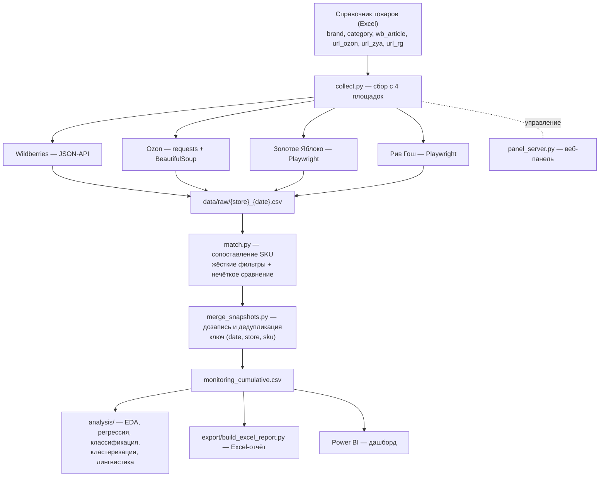

# Market Vision
### Автоматизация конкурентного анализа цен на маркетплейсах
Итоговый проект курса «Python. Анализ данных в маркетинге», СПбПУ

Pipeline на Python для еженедельного мониторинга цен конкурентов в декоративной косметике: **сбор → обработка → анализ → отчётность**. Сделан как итоговый проект курса «Python. Анализ данных в маркетинге» (СПбПУ) и одновременно как рабочий инструмент бренд-менеджмента ООО RBH — официального дистрибьютора Revolution Beauty в России.

> **Зачем читать этот README, а не отчёт.** Здесь собрано всё, что нужно для проверки: постановка задачи, источники и схема данных, какие методы анализа применены и с какими метриками, где что лежит в коде, как запустить. В конце — таблица соответствия критериям оценки со ссылками на конкретные файлы.

---

## TL;DR

- **Проблема.** Ручной мониторинг цен занимал 2–3 рабочих дня раз в два месяца, данные устаревали к моменту анализа, результат — громоздкий Excel, неудобный для коллег без технического бэкграунда.
- **Решение.** Автоматический сбор с четырёх площадок (Wildberries, Ozon, Золотое Яблоко, Рив Гош), накопительный датасет, четыре метода анализа, Excel-отчёт с цветовой индикацией, дашборд Power BI и веб-панель управления сбором.
- **Эффект.** Цикл сократился с 2–3 дней до 15–20 минут, обновление стало еженедельным вместо разового раз в два месяца.

---

## Что в данных

Накопительный датасет `monitoring_cumulative.csv` (`sep=','`, `encoding='utf-8-sig'`).

| Параметр | Значение |
|---|---|
| Наблюдений | 16 520 |
| Уникальных SKU | 1 048 |
| Брендов | 28 (Revolution + 27 конкурентов) |
| Категорий | 11 (декоративная косметика) |
| Площадок | 4 — Wildberries, Ozon, Золотое Яблоко, Рив Гош |
| Дат сбора | 16 (21.05.2026 – 18.06.2026) |
| Исторический срез | ручной мониторинг RBH, июнь 2025 – март 2026 |

### Схема (ключевые поля)

| Поле | Описание |
|---|---|
| `collected_at`, `date` | момент и дата сбора |
| `store` | площадка: `wildberries` / `ozon` / `goldapple` / `rivegauche` |
| `sku`, `brand`, `category` | идентификатор товара и его классификация |
| `name`, `description` | название и описание (описания собираются с Золотого Яблока) |
| `price_regular`, `price_final`, `discount_pct` | цена без скидки, итоговая цена, размер скидки |
| `available`, `stock_quantity` | наличие и остаток |
| `product_rating`, `feedbacks_count` | рейтинг и число отзывов |
| `promo_count`, `status`, `is_anomaly` | служебные поля контроля качества |

**Источники описаны полностью:** Wildberries — внутреннее JSON-API (`card.wb.ru/cards/v1/detail`) по артикулу; Ozon — `requests` + `BeautifulSoup`; Золотое Яблоко и Рив Гош — `Playwright` (динамическая загрузка). Выбор инструмента под каждую площадку обоснован в коде и в отчёте (раздел 2.5).

---

## Архитектура



Логика связки ручных и автоматических данных, контроль качества (защитные диапазоны цен, проверка покрытия справочника, логирование пропусков) — в разделе 2.5 отчёта.

---

## Методы анализа и результаты

К одному датасету применены **четыре разных вида анализа**. По каждому — своя метрика качества и вывод.

### 1. Разведочный анализ (EDA) — `analysis/eda_cumulative.py`
Топ-15 брендов по цене, boxplot по категориям, динамика по неделям, распределение скидок, промо-окна конкурентов, retail vs marketplace. Все графики со стилями, заголовками и легендами.

**Результат:** Revolution занимает 7-е место из 28 по средней цене (≈ 883 ₽ против рыночных ≈ 649 ₽), ценовой индекс к рынку **1.36**. Частота промо у Revolution — 13.1% против 31.5% у ASTRA. Цены на маркетплейсах примерно на 18% выше розничных.

### 2. Регрессия — `analysis/regression_segmentation.py`
Множественная регрессия: `цена ≈ время + бренд + категория + канал + объём`, с интерпретацией коэффициентов и проверкой корреляций. Плюс сегментация конкурентного поля по квартилям.

**Оценка точности:** R² = **0.658**, плюс MAE и RMSE на отложенной выборке; сравнение простой и множественной модели.

### 3. Классификация — `analysis/advanced_methods.py`
Детекция промо-окон и предсказание ценового сегмента по тексту (название + описание, TF-IDF признаки).

**Оценка точности:** precision, recall, F1, **ROC-AUC = 0.92** (текст → ценовой сегмент), confusion matrix, кросс-валидация.

### 4. Кластеризация и лингвистический анализ — `analysis/advanced_methods.py`
k-means по признакам брендов (средняя цена, темп роста, частота промо, разрыв retail/marketplace) с подбором числа кластеров по silhouette. Лингвистика: токенизация, лемматизация (`pymorphy3`), частотный анализ и TF-IDF по названиям и описаниям.

**Оценка точности:** silhouette score и читаемость кластеров; для лингвистики — доля корректного отнесения SKU к смысловой группе на ручной разметке.

---

## Отчётность и дашборды

- **Excel-отчёт** — `export/build_excel_report.py`. Цветовая индикация изменений (рост — красный, снижение — зелёный) в формате, близком к исходному файлу RBH, но формируется автоматически из накопительных данных. Флаги `--period week` (по умолчанию) и `--period month` — выгрузки и статистики за отдельные периоды.
- **Power BI** — дашборд на 4 страницы: обзор по бренду, категории × конкуренты, retail vs marketplace, промо-активность.
- **Веб-панель** — `panel_server.py` (библиотека `panel`). Статусы по каждой площадке, сворачиваемый лог, переключатель email-уведомлений, карточка «последний сбор», браузерные уведомления. Запуск без окна консоли через `Панель.vbs`.

---

## Структура репозитория

```
price-monitoring/
├── README.md
├── requirements.txt
├── .gitignore
├── collect.py                  # сбор с 4 площадок
├── match.py                    # сопоставление SKU (--threshold, --date, --evaluate)
├── merge_snapshots.py          # дозапись и дедупликация
├── run_all.py                  # оркестратор полного цикла
├── panel_server.py             # веб-панель управления
├── Панель.vbs                  # запуск панели без консоли
├── analysis/
│   ├── eda_cumulative.py
│   ├── regression_segmentation.py
│   └── advanced_methods.py     # классификация, кластеризация, лингвистика
├── export/
│   ├── build_excel_report.py   # --period week | month
│   ├── upload_to_gdrive.py
│   └── notify_email.py
├── config/
│   ├── ground_truth.csv        # эталон для оценки сопоставления
│   └── manual_overrides.csv    # ручные правки источника
└── data/
    └── monitoring_cumulative.csv
```

Все скрипты анализа находят датасет через общий `resolve_data_path()` с возможностью переопределить путь флагом `--data`.

---

## Установка и запуск

```bash
# 1. зависимости
pip install -r requirements.txt
python -m playwright install chromium   # для Золотого Яблока и Рив Гош

# 2. полный цикл: сбор -> сопоставление -> дозапись в накопительный датасет
python run_all.py

# 3. анализ (каждый скрипт сам находит monitoring_cumulative.csv)
python analysis/eda_cumulative.py
python analysis/regression_segmentation.py
python analysis/advanced_methods.py

# 4. Excel-отчёт
python export/build_excel_report.py --period week

# 5. веб-панель
python panel_server.py
```

Без повторного сбора анализ воспроизводится сразу на приложенном `data/monitoring_cumulative.csv`:

```bash
python analysis/eda_cumulative.py --data data/monitoring_cumulative.csv
```

---

## Соответствие критериям оценки

| Критерий | Где смотреть |
|---|---|
| **Постановка задачи** | этот README (TL;DR) + раздел 1.7 отчёта |
| **Сбор и обработка данных** | `collect.py`, `match.py`, `merge_snapshots.py`; источники и схема — выше и в разделе 2.5 |
| **Чтение данных из файлов (pandas)** | `analysis/*.py`, общий `resolve_data_path()`; чтение CSV/Excel через pandas |
| **Обработка данных** | очистка NaN с `isinstance`-проверками, NFC-нормализация русского текста, лемматизация `pymorphy3` |
| **Визуализация** | `analysis/eda_cumulative.py` — графики со стилями, заголовками, легендами |
| **Реализация ПО** | `analysis/advanced_methods.py`, `regression_segmentation.py` — 4 метода, анализ коэффициентов, корреляции |
| **Оценка точности** | R²/MAE/RMSE (регрессия), precision/recall/F1/ROC-AUC (классификация), silhouette (кластеризация) |
| **Оформление кода** | функции без дублирования, параметры через CLI-флаги, комментарии, PEP8 |

### На дополнительные баллы

- **GitHub** — этот репозиторий.
- **Несколько видов анализа к одному датасету** — регрессия, классификация, кластеризация, лингвистика (часть не входила в ТЗ).
- **Выгрузки и статистики за периоды** — `build_excel_report.py --period week|month`, статистики по группам.
- **Интерфейс для пользователя** — веб-панель `panel_server.py`.

---

## Ограничения

4 площадки из 8 на рынке; нет данных о фактических продажах; справочник товаров заполняется вручную; скрапер чувствителен к изменениям вёрстки площадок. План развития: остальные площадки, переход на БД, оповещения о промо в Telegram, прогнозная модель цен.

---

## Контекст

Бренд-менеджмент ООО RBH (дистрибьютор Revolution Beauty в РФ). Внутренние финансовые метрики, скидочные стратегии и условия контрактов с ритейлерами в репозитории не раскрываются.
